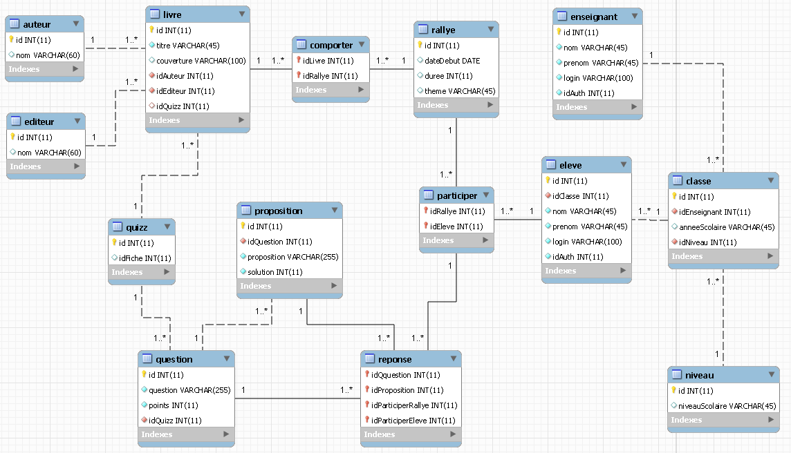

## MMADI Nasfahdine BTS SIO 2

# Rallye Lecture | Situation 2

## Code Igniter

Cette situation a pour but de réaliser le site web rallye lecture accessible par les professeurs et les élèves afin d'avoir accès aux livres disponibles, aux quizz, à la classe etc...

## Outils utilisés
<ul>
  <li>HTML</li>
  <li>CSS</li>
  <li>PHP</li>
  <li>Code Igniter</li>
<ul>

## Cas d'utilisation et différent du projet rallye lecture

## Mettre en place la base de donnée rallye lecture

## Modèle Vue Controleur

A l'aide du framework Code Igniter on met en place la notion de MVC

## Accéder au site

On accède ensuite au site web et consulter les différents tables en utilisant le compte :

- user : admin@sio.jjr
- pwd  : siojjr

Un exemple sur la vue "Livres" :

